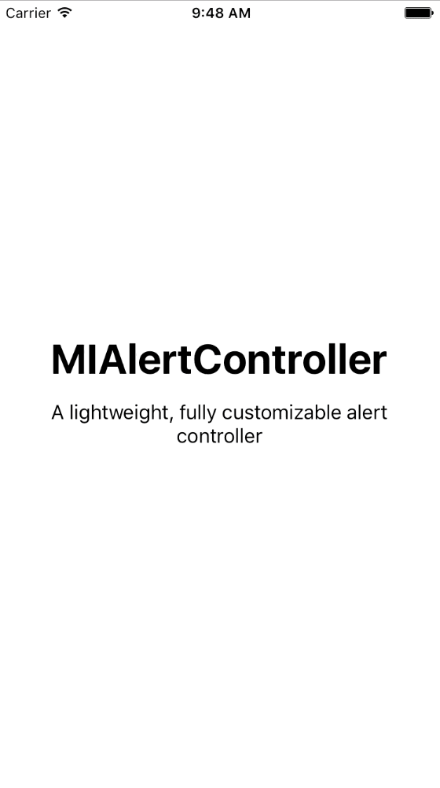

# MIAlertController
A simple fully customizable alert controller

[](https://developer.apple.com/iphone/index.action)
[](https://developer.apple.com/swift/) 
[](https://img.shields.io/cocoapods/v/RSKCollectionViewRetractableFirstItemLayout.svg) 



# Setup
- Add ```pod 'MIAlertController', '~> 1.0'``` to your Podfile or copy the "MIAlertController" folder to your project.
- Create a new instance with just a line of code

```
MIAlertController(

  title: "Your alert title",
  message: "Your alert description",
  buttons: [
    MIAlertController.Button(title: "Button one", action: {
      print("button one tapped")
    }),
    MIAlertController.Button(title: "Button two", action: {
      print("button two apped
    })
  ]

).presentOn(self)
```
# Customization
- You can customize the alert's behavior and UI by creating a new instance of the struct MIAlertController.Config and changing it's property as you like 
  - config.dismissOnTouchOutsideEnabled -> It allows the user to dismiss the alert by tapping anywhere outside it
  - config.backgroundColor -> Overlay layer background
  - config.alertViewBackgroundColor -> Alert background
  - config.alertViewCornerRadius -> Alert corner radius
  - config.alertMarginSize -> The max margins between the alert and the screen
  - config.separatorColor -> The color of separator between the buttons
  - config.alertViewMaxSize -> The max size of the alert
  - config.titleLabelFont -> the font of the title
  - config.titleLabelTextColor -> the color of the title
  - config.titleLabelTextAlignment -> the text alignment of the title
  - config.messageLabelFont -> the font of the message
  - config.messageLabelTextColor -> the color of the message
  - config.messageLabelTextAlignment -> the text alignment of the message
  - config.messageVerticalSpaceFromTitle -> the space from title of the message
  - config.buttonBackgroundView -> the background color of the view who contains the buttons
  - config.firstButtonRatio -> the ratio between the width of the buttons container and the width of the first button; Only available with two buttons
- There are three type of buttons (.Default, .Destructive, .Cancel) with different UI but you can create a new type by using the struct MIAlertController.Button.Config
  - config.font -> the font of the button
  - config.textColor -> the color of the button's text
  - config.textAlignment -> the alignment of the button's text
  - config.backgroundColor -> the background color of the button
  - config.buttonHeight -> the height of the button
  - config.contentEdgeOffset -> the edge offset of the button

# Example
```
// Alert UI and behavior
var googlishAlertControllerConfig = MIAlertController.Config()

googlishAlertControllerConfig.firstButtonRatio = 0.8
googlishAlertControllerConfig.alertViewCornerRadius = 1
googlishAlertControllerConfig.messageLabelTextColor = UIColor(white: 0.45, alpha: 1)

googlishAlertControllerConfig.messageVerticalSpaceFromTitle = 25
googlishAlertControllerConfig.messageLabelFont = UIFont.systemFontOfSize(17)

googlishAlertControllerConfig.alertMarginSize = CGSize(width: 10, height: 10)
googlishAlertControllerConfig.alertViewMaxSize = CGSize(width: UIScreen.mainScreen().bounds.size.width - 80, height: 340)

googlishAlertControllerConfig.titleLabelTextAlignment = NSTextAlignment.Left
googlishAlertControllerConfig.messageLabelTextAlignment = NSTextAlignment.Left

// Buttons UI
var googlishAlertControllerLeftButtonConfig = MIAlertController.Button.Config()

googlishAlertControllerLeftButtonConfig.textColor = UIColor(red: 19/255.0, green: 152/255.0, blue: 138/255.0, alpha: 1)
googlishAlertControllerLeftButtonConfig.textAlignment = .Right
googlishAlertControllerLeftButtonConfig.font = UIFont.boldSystemFontOfSize(15)

var googlishAlertControllerRightButtonConfig = MIAlertController.Button.Config()

googlishAlertControllerRightButtonConfig.textColor = UIColor(red: 19/255.0, green: 152/255.0, blue: 138/255.0, alpha: 1)
googlishAlertControllerRightButtonConfig.font = UIFont.boldSystemFontOfSize(15)

let alertController = MIAlertController(
  title: "I'm a googlish alert!",
  message: "Lorem ipsum dolor sit amet, consectetur adipiscing elit, sed do eiusmod tempor incididunt ut labore et dolore magna aliqua. Ut enim ad minim veniam, quis nostrud exercitation ullamco laboris",
  config: googlishAlertControllerConfig
)

alertController.addButton(
  MIAlertController.Button(title: "COOL", config: googlishAlertControllerLeftButtonConfig, action: {
    print("cool tapped")
  })
)

alertController.addButton(
  MIAlertController.Button(title: "OK", config: googlishAlertControllerRightButtonConfig, action: {
    print("ok tapped")
  })
)

alertController.presentOn(self)

```
#Demo
In this repository you can also find a demo.

# Info
If you like this git you can follow me here or on twitter :) [@MarioIannotta](http://www.twitter.com/marioiannotta)

Cheers from Italy!
